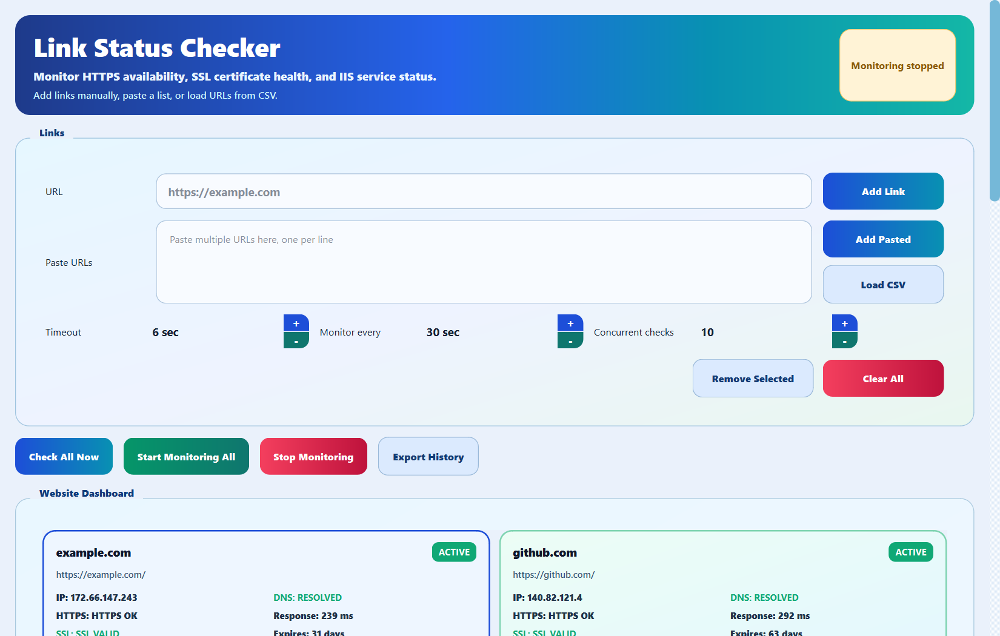

# Link Status Checker

I built this because I got tired of opening a browser tab to check whether our
sites were still up, and then opening services.msc to check whether IIS was
still running, and then opening SSMS to look at a database. It is a Windows
desktop dashboard that does all three in one window.

It watches websites over HTTPS, resolves their DNS, reads their SSL
certificates, lets me start or restart the two IIS services I care about, and
reads database metadata from SQL Server without ever asking me for a password.



## What it actually does

Websites:

- Add one URL at a time, paste a whole list one per line, or load a CSV.
- Anything you type gets normalized to HTTPS, so `example.com`,
  `http://example.com` and `https://example.com` all end up as the same target.
  Internal hosts with a port like `intranet:8080` work too.
- Every site gets a card showing domain, IP, DNS result, up or down, HTTPS
  status, SSL status, days until the certificate expires, response time and
  when it was last checked.
- Checks run concurrently in a thread pool, so the window does not freeze.
- Start and stop scheduled monitoring on a timer you pick.
- Every check is appended to `logs/checks.csv`, and you can export what is on
  screen to your own CSV.

SSL:

- Reports `SSL VALID`, `SSL EXPIRES SOON`, `SSL EXPIRED`, `SSL NOT YET VALID`,
  `SSL ERROR`, or `SSL NOT CHECKED` when a check could not run at all.
- Certificates that fail validation still get their expiry date and common name
  read out of the raw certificate bytes, so an expired or self signed cert tells
  you when it expired instead of showing you nothing.

IIS:

- Status, start and restart for exactly two services, `W3SVC` and `WAS`. The
  list is a hardcoded allowlist. The app does not run shell commands and will
  not accept a service name you type in.
- Start and restart wait for the service to actually reach the state you asked
  for, and tell you if it did not.
- Actions are logged to `logs/iis_actions.csv`.

Database:

- Read only metadata from SQL Server using Windows Integrated Authentication
  through Microsoft's `mssql-python` package.
- Shows database size, schemas, tables with row and column counts, and column
  details.
- The app never accepts, stores or logs a username or password. Error messages
  get scrubbed before display so server and database names do not leak.
- Reads are logged to `logs/database_metadata.csv`.

## Running it

The quickest way, no Python needed:

```text
LinkStatusChecker.exe
```

From source, Python 3.10 or newer:

```powershell
py -m pip install -r requirements.txt
py main.py
```

## Running the tests

```powershell
py -m pip install -r requirements-dev.txt
py -m pytest
py -m ruff check .
```

That gives 147 passed and 1 skipped on Windows. The skip is a test for the
non Windows guard on the IIS controls, which cannot run here on purpose. One
test reaches the public internet to read a real certificate and is marked
`network`, so skip it with `py -m pytest -m "not network"` if you are offline.

## Rebuilding the exe

The exe does not update itself when you edit `main.py`, so rebuild it after
changes:

```powershell
py -m pip install -r requirements-dev.txt pyinstaller
py -m PyInstaller --noconfirm --clean --onefile --windowed --name LinkStatusChecker ^
  --collect-submodules mssql_python ^
  --add-binary "<site-packages>\mssql_python\ddbc_bindings.cp312-amd64.pyd;mssql_python" ^
  --add-binary "<site-packages>\mssql_python\msvcp140.dll;mssql_python" ^
  --add-data "<site-packages>\mssql_python\libs\windows;mssql_python/libs/windows" ^
  main.py
```

The `--collect-submodules` and `--add-binary` lines matter. Without them
PyInstaller builds an exe that starts fine but reports that `mssql-python` is
not installed the moment you click Read Metadata. Do not use
`--collect-all mssql_python` either, since that bundles the Linux and macOS
driver binaries into a Windows only exe and adds about 20 MB for nothing.

If PyInstaller cannot delete its own `build` folder, that is usually OneDrive
holding the files. Build to a path outside your synced folder with `--distpath`
and `--workpath` and copy the exe back.

## Known limitations

Being honest about the rough edges:

- `config.example.yaml` is a template and nothing more. The app does not read
  it. Timeout, interval and concurrency come from the spinners in the window,
  and the SSL warning threshold and the 50 link cap are constants in `main.py`.
  I left the file in because it documents the intended shape of a config file I
  have not written the loader for yet.
- `ACTIVE` only means the server returned some HTTP response over HTTPS. A site
  returning 500 on every request still shows as `ACTIVE`. The status column
  answers "is it reachable", not "is it healthy".
- The history table keeps the newest 500 rows on screen and drops older ones.
  Nothing is lost, `logs/checks.csv` keeps every check ever run.
- Around 50 links is the practical ceiling and the app enforces it.
- No proxy support. It uses whatever `urllib` picks up from the environment.
- IIS start and restart usually need the app running as administrator.
  Otherwise you get an access denied message.
- IIS controls are disabled on anything that is not Windows.
- The database panel needs SQL Server reachable and your Windows account
  granted read access. There is a `Trust server certificate for local test`
  checkbox for local instances with self signed certificates. Leave it off in
  production unless your DBA says otherwise.
- The certificate reader understands the common name and validity dates. It
  does not read subject alternative names, so a cert valid for the host through
  a SAN entry shows the common name only.
- Everything is one 2000 line `main.py`. It works and it is tested, but it
  wants splitting up.

## Files

```text
main.py                             the whole app
theme_light.qss                     the light theme
tests/                              pytest suite
requirements.txt                    what the app needs to run
requirements-dev.txt                what the tests need
pyproject.toml                      pytest and ruff config
config.example.yaml                 aspirational, not loaded
DATABASE_FEATURE_IMPLEMENTATION.md  SQL Server setup and permissions
logs/                               csv logs, gitignored
LinkStatusChecker.exe               built artifact, gitignored
```
