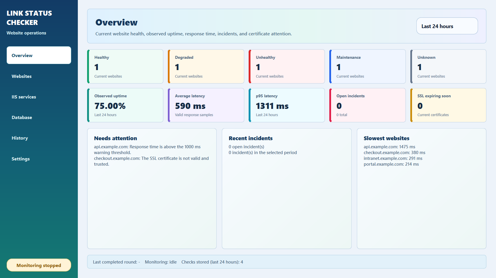
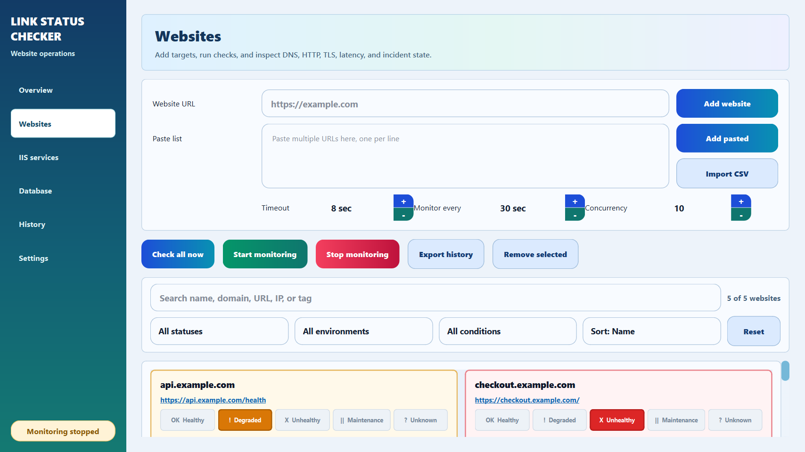

# Link Status Checker

I use this dashboard to keep website checks, IIS service controls, and SQL
Server metadata in one Windows application. It checks each saved website on
demand or on a schedule, keeps the results in a local SQLite database, and
explains failures without making the user read raw Python or TLS errors.



The Websites page shows the individual checks:



## What it monitors

For each website the application records:

* DNS resolution and all returned IPv4 or IPv6 addresses
* HTTPS reachability and the HTTP response code
* SSL certificate trust and expiry
* Response time and recent latency samples
* The current health status and the reason for it
* Consecutive failures, recovery, and incident state

The URL on every website card is clickable. It opens through Qt in the default
browser and only accepts `http` or `https`. It is never passed to a command
shell.

The IIS page checks, starts, or restarts `W3SVC` and `WAS`. Those two service
names are fixed in an allowlist. The app does not accept arbitrary service
commands.

The Database page reads SQL Server metadata with Windows Integrated
Authentication. It shows database size, schemas, tables, row counts, and
columns. There are no username or password fields. Queries are read only and
the connection uses `ApplicationIntent=ReadOnly`.

## Website statuses

Each card always shows all five status names. Only the current one is strongly
highlighted.

* `Healthy`: DNS, HTTP, content, latency, and required SSL checks passed.
* `Degraded`: the website is reachable but slow, the certificate expires soon,
  or a temporary failure has not reached the incident threshold.
* `Unhealthy`: a confirmed security failure exists, a critical latency limit
  was crossed, or repeated checks failed.
* `Maintenance`: the website was intentionally excluded from incidents and
  uptime.
* `Unknown`: a reliable result is not available yet.

The default response range is HTTP `200` through `399`. A `500` response is
never shown as healthy. The default latency warning is `1000 ms`, the critical
limit is `3000 ms`, an incident opens after three failures, and recovery needs
two successful checks.

## Website settings and filters

Use the Edit button on a card to change its display name, URL, environment,
customer, tags, IIS relationship, accepted HTTP range, content rules, timeout,
response time limits, failure and recovery thresholds, SSL warning period,
monitoring state, or maintenance note. These settings are stored in SQLite and
restored when the application starts again.

The Websites page combines text, status, environment, and condition filters.
Condition filters cover SSL expiry, invalid SSL, slow responses, open
incidents, IIS related sites, and sites with monitoring disabled. Results can
be sorted by name, severity, response time, SSL expiry, or last check. Text
search includes the website name, domain, URL, IP address, customer, and tags.

## Uptime and incidents

History is stored in:

```text
%LOCALAPPDATA%\LinkStatusChecker\monitoring.db
```

Observed uptime is calculated as:

```text
(Healthy checks + Degraded checks)
---------------------------------- x 100
 Healthy + Degraded + Unhealthy
```

Maintenance and Unknown checks are shown separately and excluded from the
denominator. The Overview page can calculate the last hour, 24 hours, 7 days,
30 days, or 90 days.

An incident opens when a website reaches the configured failure threshold. New
failed checks remain part of the same incident. The incident closes after the
configured number of successful recovery checks.

The dashboard also shows average latency, median and p95 calculations in the
stored analytics layer, current status totals, open incidents, slow websites,
and certificates that need attention.

## SSL problem explanations

Certificate expiry and certificate trust are separate checks. A certificate can
have months remaining and still be unsafe because its hostname is wrong or its
issuer cannot be verified.

The application classifies common problems such as:

* expired or not yet valid certificates
* hostname mismatch
* self signed certificates
* missing intermediate certificates or an untrusted issuer
* TLS handshake failure
* DNS failure
* connection refusal and timeout

The card shows a plain explanation and recommended action. The original
technical message remains available under Problem details.

## Running the application

The release has one file:

```text
dist\LinkStatusChecker.exe
```

Double click it. Python is not required, no console window opens, and no QSS
file needs to sit beside the executable. The theme, icon, SQLite support, and
SQL Server runtime files are bundled.

The verified 3.0.0 executable is `54,924,984` bytes. The previous executable
was `65,215,121` bytes, so this build is `10,290,137` bytes smaller, a `15.78%`
reduction.

Logs, settings, and monitoring history are written under:

```text
%LOCALAPPDATA%\LinkStatusChecker
```

This keeps the app working when the executable is placed in a read only folder
such as `Program Files`.

## Running from source

Python 3.10 or newer is required:

```powershell
py -m pip install -r requirements.txt
py main.py
```

Development checks:

```powershell
py -m pip install -r requirements-dev.txt
py -m ruff check .
py -m ruff format --check .
py -m pytest -m "not network"
```

Build the Windows executable:

```powershell
powershell -ExecutionPolicy Bypass -File scripts\build_windows.ps1
```

The PyInstaller setup deliberately includes only the Windows x64
`mssql-python` driver files. Optional Azure authentication libraries and
development packages are excluded because this application uses Windows
Integrated Authentication.

## SQL Server setup

Use SSMS to grant the Windows account running the application read access to
the target database:

```sql
USE [YourDatabase];
GO
GRANT CONNECT TO [DOMAIN\WindowsUser];
GRANT VIEW DEFINITION TO [DOMAIN\WindowsUser];
GO
```

The Trust server certificate option is for an approved local or test instance
with a certificate that is not trusted by Windows. Leave it off for production
unless the database administrator confirms the exception.

More detail is in
[DATABASE_FEATURE_IMPLEMENTATION.md](DATABASE_FEATURE_IMPLEMENTATION.md).

## Project layout

```text
main.py                              small compatibility launcher
src/link_status_checker/             application package
src/link_status_checker/domain/      status rules
src/link_status_checker/monitoring/  clear network and SSL problems
src/link_status_checker/storage/     SQLite schema, incidents, analytics
src/link_status_checker/ui/          reusable PySide6 widgets
assets/                              application icon
scripts/                             checks, build, benchmark, screenshots
tests/                               regression and feature tests
docs/                                architecture and monitoring notes
LinkStatusChecker.spec               one file Windows build
```

## Current limits

The application accepts up to 2,000 saved websites and renders 50 cards at a
time. Monitoring uses a bounded Qt thread pool with configurable concurrency.
This is a tested practical target, not a claim of unlimited capacity.

The release test run collected 182 tests: 181 passed and one optional test was
skipped. Ruff and the formatting check passed. A synthetic benchmark loaded
and filtered 1,000 saved websites while keeping only 50 card widgets active,
and calculated analytics over 100,000 stored checks.

Custom analytics date ranges, history retention cleanup, JSON response
assertions, redirect policy controls, per website schedule overrides, and a
dedicated last incident date filter are not included yet. Public website
results still depend on the computer's DNS, proxy, firewall, and network.

IIS start and restart usually need administrator permission. Website checks and
SQL metadata reads do not.

The benchmark and release evidence are recorded in
[docs/release_checklist.md](docs/release_checklist.md).
